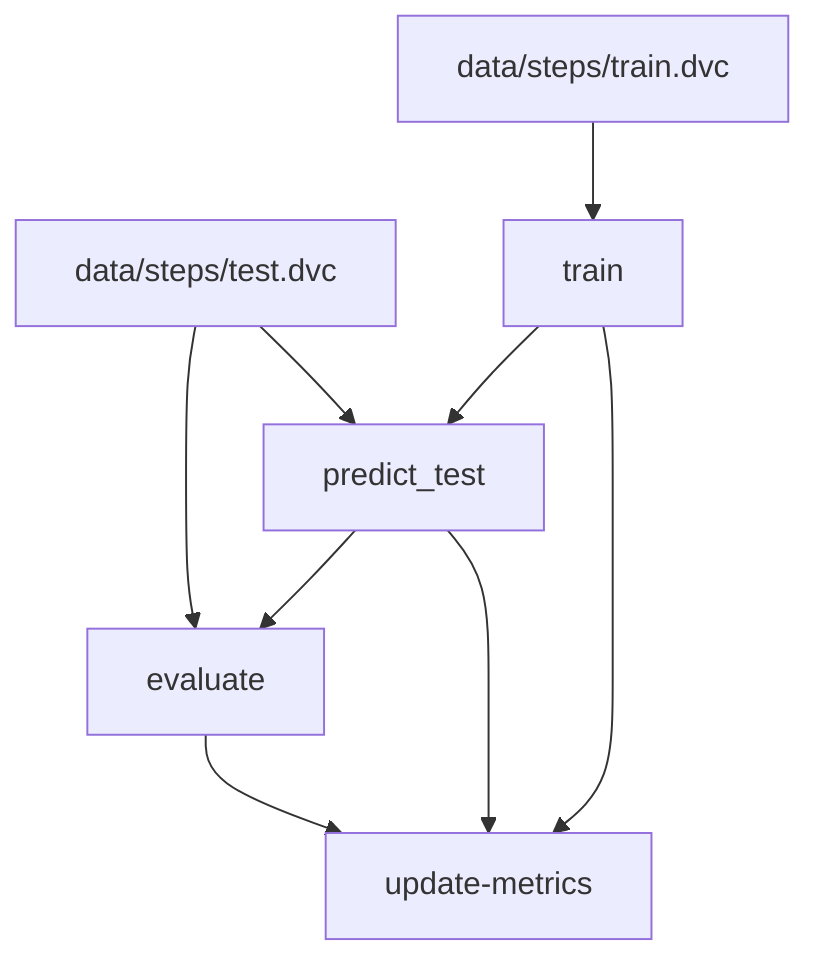

# step-counter

    
    

# Metrics
| Path                       | num_samples   | test.f1-score_macro   | test.precision_macro   | test.predicted_step_count   | test.recall_macro   | test.roc_auc   | test.support_macro   | test.target_step_count   | train.accuracy   | train.f1_macro   | train.precision_macro   | train.recall_macro   | validation.accuracy   | validation.f1_macro   | validation.precision_macro   | validation.recall_macro   |
|----------------------------|---------------|-----------------------|------------------------|-----------------------------|---------------------|----------------|----------------------|--------------------------|------------------|------------------|-------------------------|----------------------|-----------------------|-----------------------|------------------------------|---------------------------|
| reports/metrics/train.json | 7919          | -                     | -                      | -                           | -                   | -              | -                    | -                        | 0.87             | 0.79             | 0.76                    | 0.85                 | 0.86                  | 0.77                  | 0.74                         | 0.83                      |
| reports/metrics/test.json  | -             | 0.84                  | 0.84                   | 48                          | 0.83                | 0.93           | 1585.0               | 45                       | -                | -                | -                       | -                    | -                     | -                     | -                            | -                         |

# Steps Graph

_graph_end_
