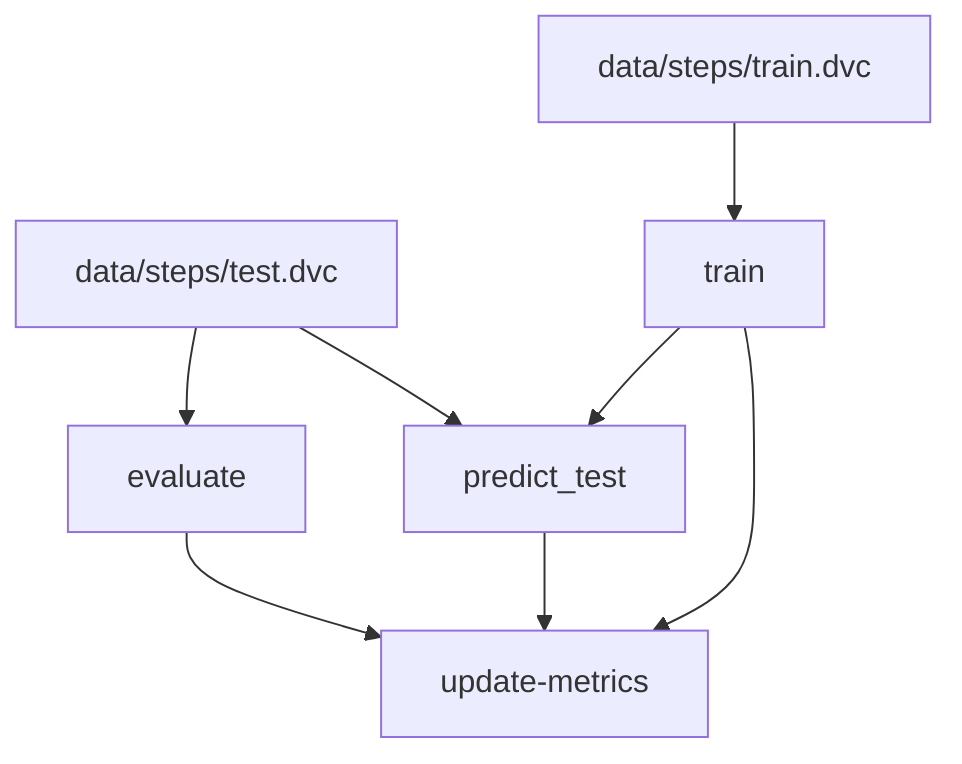

# step-counter

    

# Metrics
| Path                       | test.f1-score_macro   | test.precision_macro   | test.recall_macro   | test.support_macro   | train.f1_macro   | train.precision_macro   | train.recall_macro   | validation.f1_macro   | validation.precision_macro   | validation.recall_macro   |
|----------------------------|-----------------------|------------------------|---------------------|----------------------|------------------|-------------------------|----------------------|-----------------------|------------------------------|---------------------------|
| reports/metrics/train.json | -                     | -                      | -                   | -                    | 0.43             | 0.5                     | 0.49                 | 0.42                  | 0.49                         | 0.49                      |
| reports/metrics/test.json  | 0.41                  | 0.49                   | 0.49                | 1585.0               | -                | -                       | -                    | -                     | -                            | -                         |

# Steps Graph

_graph_end_
