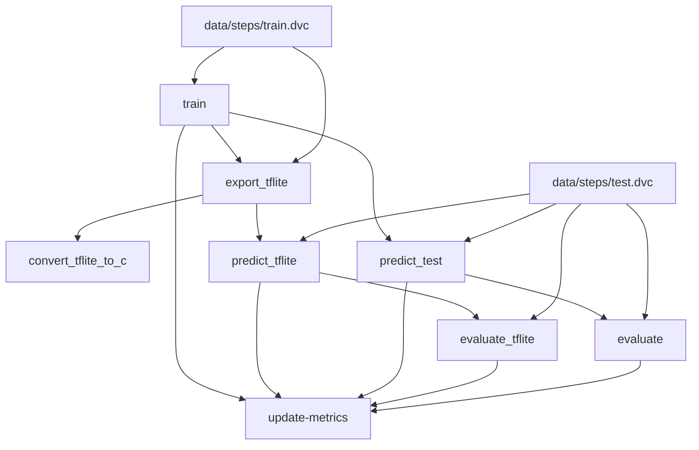

# step-counter

    
    

# Setting up TFlite for Arduino
Follow the steps [from this repository](https://github.com/tensorflow/tflite-micro-arduino-examples#github)
Clone examples repository to arduino library folder to make it available in Arduino IDE and include TensorFlowLite.h in your sketch.

# Metrics
| Path                             | num_samples   | test.f1-score_macro   | test.precision_macro   | test.predicted_step_count   | test.recall_macro   | test.roc_auc   | test.support_macro   | test.target_step_count   | train.accuracy   | train.f1_macro   | train.precision_macro   | train.recall_macro   | validation.accuracy   | validation.f1_macro   | validation.precision_macro   | validation.recall_macro   | validation.threshold_mean   | validation.threshold_std   |
|----------------------------------|---------------|-----------------------|------------------------|-----------------------------|---------------------|----------------|----------------------|--------------------------|------------------|------------------|-------------------------|----------------------|-----------------------|-----------------------|------------------------------|---------------------------|-----------------------------|----------------------------|
| reports/metrics/train.json       | 7919          | -                     | -                      | -                           | -                   | -              | -                    | -                        | 0.89             | 0.82             | 0.79                    | 0.87                 | 0.9                   | 0.8                   | 0.81                         | 0.81                      | 0.7                         | 0.14                       |
| reports/metrics/test.json        | -             | 0.82                  | 0.84                   | 58                          | 0.81                | 0.92           | 1585.0               | 45                       | -                | -                | -                       | -                    | -                     | -                     | -                            | -                         | -                           | -                          |
| reports/metrics_tflite/test.json | -             | 0.82                  | 0.84                   | 58                          | 0.81                | 0.92           | 1585.0               | 45                       | -                | -                | -                       | -                    | -                     | -                     | -                            | -                         | -                           | -                          |

# Steps Graph

_graph_end_
