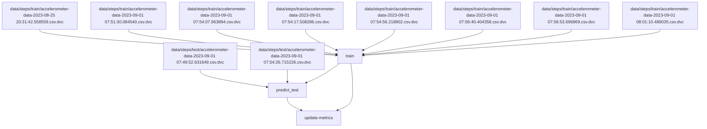

# step-counter

    

# Metrics
| Path                       | train.f1_macro   | train.precision_macro   | train.recall_macro   | validation.f1_macro   | validation.precision_macro   | validation.recall_macro   |
|----------------------------|------------------|-------------------------|----------------------|-----------------------|------------------------------|---------------------------|
| reports/metrics/train.json | 0.43             | 0.5                     | 0.49                 | 0.42                  | 0.49                         | 0.49                      |

# Steps Graph

_graph_end_
